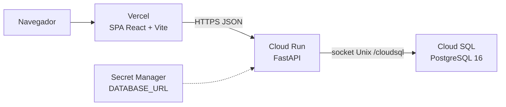
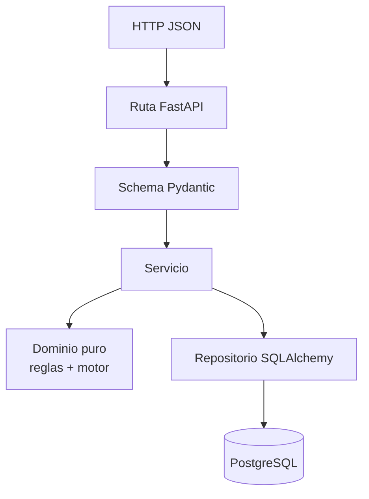
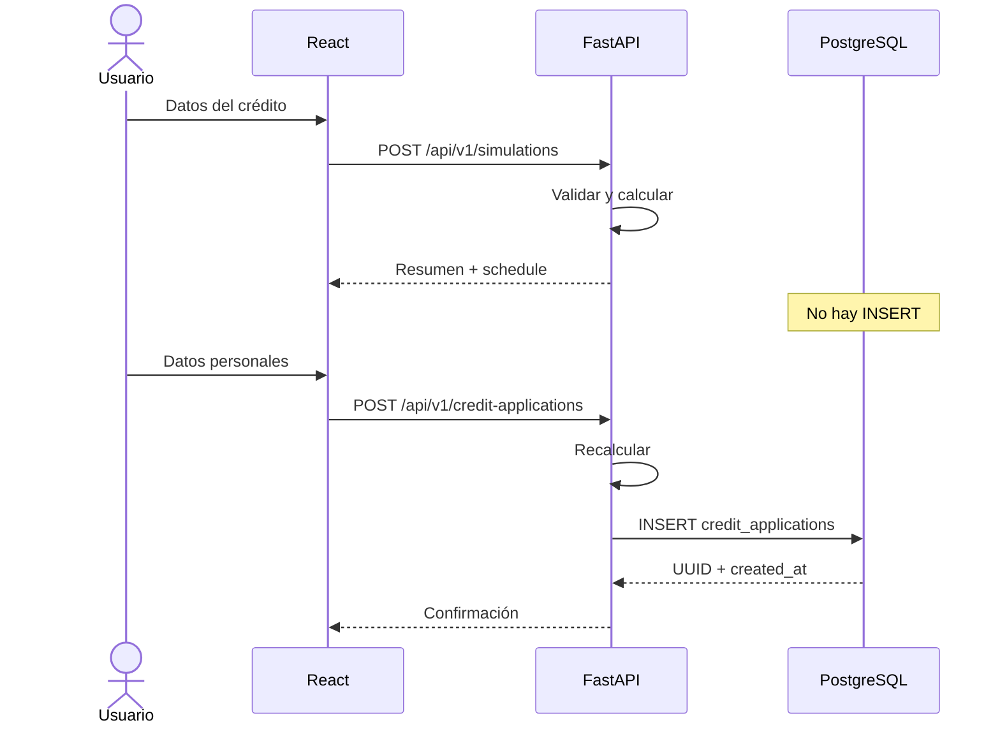

# Informe técnico

## Simulador de crédito para movilidad eléctrica

**Prueba técnica — Desarrollador(a) Full Stack**  
**Organización:** Roda  
**Candidato:** Chrispin12  
**Fecha de este documento:** 14 de agosto de 2026

---

## Resumen

Se entregó una aplicación web full stack que permite simular un crédito para bicicleta o moto eléctrica, ver el resumen y el plan de pagos, y registrar una solicitud persistida en PostgreSQL. El cálculo financiero ocurre **solo en el backend**. El frontend es un cliente React que consume la API.

La solución está desplegada en internet:

| Entregable | Enlace |
| --- | --- |
| Frontend (Vercel) | https://prueba-tecnica-roda-frontend.vercel.app |
| Backend (Cloud Run) | https://roda-credit-api-446921260054.us-central1.run.app |
| Salud de la API | https://roda-credit-api-446921260054.us-central1.run.app/health |
| Documentación OpenAPI | https://roda-credit-api-446921260054.us-central1.run.app/docs |
| Repositorio frontend | https://github.com/Chrispin12/PruebaTecnicaRodaFrontend |
| Repositorio backend | https://github.com/Chrispin12/PruebaTecnicaRodaBackend |

PostgreSQL en producción es **Cloud SQL** (PostgreSQL 16), instancia `roda-pg`, base `roda`. Cumple el requisito de persistir solicitudes en PostgreSQL.

---

## 1. Problema

Roda es una fintech de movilidad eléctrica y financiamiento inclusivo. La prueba pide un **simulador de crédito** que evalúe frontend, backend, comunicación entre servicios, modelado, validaciones, organización del código y una entrega **funcional y desplegada**.

### Historia de usuario (HU-01)

Una persona interesada en financiar un vehículo eléctrico necesita ingresar datos básicos del crédito y del vehículo para conocer el valor estimado de las cuotas y el resumen **antes** de decidir.

### Requerimientos funcionales cubiertos

| Código | Requisito | Implementación |
| --- | --- | --- |
| RF-01 | Formulario: tipo, valor, inicial, plazo | React + validación Zod; catálogo de modelos de ejemplo |
| RF-02 | Cálculo en backend | Motor `Decimal` en `app/domain` (FastAPI) |
| RF-03 | Resumen (valor, inicial, financiado, cuota, intereses, total) | Respuesta de `POST /api/v1/simulations` |
| RF-04 | Tabla de amortización | Campo `schedule` en la misma respuesta |
| RF-05 | Solicitud (nombre, apellido, correo, teléfono, ciudad) + simulación | `POST /api/v1/credit-applications` → tabla `credit_applications` |

### Validaciones mínimas

| Regla del enunciado | Dónde se aplica |
| --- | --- |
| Valor del vehículo ≥ $500.000 COP | Dominio Python + CHECK PostgreSQL + UI |
| Cuota inicial ≤ valor del vehículo | Dominio + CHECK + UI |
| Campos obligatorios | Pydantic + Zod |
| Números positivos | Dominio (inicial ≥ 0; financiado > 0) |
| Correo con formato válido | `EmailStr` + Zod |
| Teléfono solo números | 7–15 dígitos; `+` opcional en API |

---

## 2. Solución

Dos repositorios independientes (como pide el enunciado), un contrato HTTP JSON versionado (`/api/v1`).

1. **Simular** no persiste. El usuario puede iterar sin ensuciar la base.
2. **Solicitar** vuelve a calcular en el servidor. El cliente **no** puede imponer cuota ni intereses. Lo persistido es lo que el servidor acaba de calcular.
3. **Una tabla** (`credit_applications`) guarda solicitante, condiciones, tasas usadas y resultado. La amortización no se guarda: es determinista.

Supuestos financieros **no definidos por Roda** (el enunciado no da tasa ni sistema):

- Tasa demo: 24 % efectiva anual (`CREDIT_ANNUAL_RATE`).
- Conversión a mensual: \((1 + EA)^{1/12} - 1\) (no EA/12).
- Amortización francesa (cuota fija).
- `Decimal` + `ROUND_HALF_UP`. La última cuota deja saldo `0.00`.
- Totales = suma de la tabla, no cuota × plazo.

Los modelos del catálogo (Urban Air, Cargo Pro, etc.) son **demo**. No representan el catálogo comercial de Roda.

---

## 3. Arquitectura

### 3.1 Vista de despliegue



CORS: el origen de Vercel (`https://prueba-tecnica-roda-frontend.vercel.app`, sin barra final) está en `CORS_ALLOW_ORIGINS`. En `ENVIRONMENT=production` no se permite `*`.

### 3.2 Vista de capas (backend)



El dominio no importa FastAPI ni SQLAlchemy. Se puede probar el motor sin red ni base.

### 3.3 Flujo de simulación vs. solicitud



### 3.4 Modelo de datos

Una fila por solicitud formal:

- Identidad: `id` (UUID), `created_at` (timestamptz).
- Persona: `first_name`, `last_name`, `email`, `phone`, `city`.
- Crédito: `vehicle_type`, `vehicle_value`, `down_payment`, `term_months`.
- Tasas usadas: `annual_interest_rate`, `monthly_interest_rate`.
- Resultado: `financed_amount`, `monthly_payment`, `total_interest`, `total_payment`.

Importes `NUMERIC(14,2)`. Tasas `NUMERIC(8,6)`. Esquema con **Alembic**, no `create_all`.

---

## 4. Tecnologías

### Backend (obligatorio: Python + PostgreSQL)

| Tecnología | Rol |
| --- | --- |
| Python 3.12 | Runtime |
| FastAPI | API REST y OpenAPI |
| Pydantic v2 | Contratos y settings |
| SQLAlchemy 2 | ORM |
| Alembic | Migraciones |
| PostgreSQL 16 | Persistencia |
| psycopg 3 | Driver |
| Uvicorn | ASGI |
| pytest / ruff | Tests y calidad |
| Docker | Imagen de Cloud Run |

### Frontend (obligatorio: React)

| Tecnología | Rol |
| --- | --- |
| React 19 + TypeScript | UI |
| Vite 8 | Build |
| Tailwind CSS 4 | Estilos |
| TanStack Query | Mutaciones HTTP |
| React Hook Form + Zod | Formularios |
| Vitest + MSW | Tests |

### Infraestructura

| Pieza | Uso |
| --- | --- |
| Vercel | SPA estática |
| Google Cloud Run | API contenedorizada |
| Cloud SQL | PostgreSQL administrado |
| Artifact Registry | Imagen Docker |
| Secret Manager | `DATABASE_URL` |
| GitHub Actions | CI (lint, tests) |

---

## 5. Cómo se construyó

1. **Fundación API:** settings, errores homogéneos (`code` + `message`), `/health`, Docker Compose, Alembic.
2. **Motor financiero:** dominio puro, tests de redondeo y última cuota.
3. **Simulación:** `POST /api/v1/simulations` (200, sin persistir).
4. **Solicitud:** `POST /api/v1/credit-applications` (201, recálculo + INSERT).
5. **Frontend:** formulario, resumen, tabla, solicitud, confirmación, estados de carga y error.
6. **UX:** catálogo, cuota inicial mínima, casilla “sin cuota inicial”, jerarquía visual de la cuota.
7. **Producción:** imagen multi-stage, Job de migraciones, Cloud Run, Vercel con `VITE_API_URL`.

Principio rector: **el dinero no se calcula dos veces**. Si el cliente envía un `monthly_payment`, se ignora.

---

## 6. API

| Método | Ruta | Persistencia | HTTP |
| --- | --- | --- | --- |
| GET | `/health` | No | 200 |
| POST | `/api/v1/simulations` | No | 200 |
| POST | `/api/v1/credit-applications` | Sí | 201 |

Errores: `400` regla de negocio, `422` contrato, `500` interno sin traceback al cliente.

---

## 7. Despliegue y almacenamiento en la nube

### Frontend (Vercel)

`VITE_API_URL` se **incrusta en el build**. Si falta, la app no arranca (pantalla en blanco). Valor de producción:

`https://roda-credit-api-446921260054.us-central1.run.app`

### Backend (Cloud Run)

- Proyecto: `roda-credit-cs0603`
- Región: `us-central1`
- Imagen: `us-central1-docker.pkg.dev/roda-credit-cs0603/roda/roda-credit-api:v1`
- Migraciones: Job `roda-credit-migrate` (`alembic upgrade head`), **no** en el startup del servicio.

### Datos (Cloud SQL)

La API no abre el puerto 5432 a internet. Usa el socket:

`postgresql+psycopg://…@/roda?host=/cloudsql/roda-credit-cs0603:us-central1:roda-pg`

Las solicitudes quedan en `credit_applications`. Consulta:

```sql
SELECT id, email, vehicle_type, monthly_payment, created_at
FROM credit_applications
ORDER BY created_at DESC;
```

---

## 8. Cómo ejecutar en local

**Backend** (desde el repositorio de la API):

```bash
copy .env.example .env
docker compose up --build --wait
```

API: http://localhost:8000 — Docs: http://localhost:8000/docs

**Frontend:**

```bash
copy .env.example .env
npm install
npm run dev
```

UI: http://localhost:5173 — `VITE_API_URL=http://localhost:8000`

---

## 9. Decisiones técnicas

| Decisión | Por qué |
| --- | --- |
| FastAPI | OpenAPI nativo, Pydantic, asíncrono; sugerido en el enunciado |
| Una tabla | El alcance no exige clientes ni cuotas persistidas |
| Recalcular al persistir | Evita que el cliente falsifique el plan |
| `Decimal` | El crédito no debe usar `float` |
| Cloud SQL + Cloud Run | PostgreSQL real, sin administrar VMs |
| Vercel | SPA Vite, CDN, variable de build |
| Sin JWT | El enunciado no pide autenticación |

---

## 10. Fuera de alcance (deliberado)

Login, KYC, documento de identidad, scoring, desembolso, pasarela de pago, microservicios, Kubernetes.

---

## 11. Criterios del enunciado vs. evidencia

| Criterio | Evidencia |
| --- | --- |
| Simulación correcta | Motor + tests + UI en Vercel |
| Separación front/back | Dos repos, dos URLs |
| React ↔ Python | CORS + `VITE_API_URL` |
| PostgreSQL | Cloud SQL + Alembic |
| Validaciones | Pydantic, dominio, Zod, CHECK |
| UX básica | Responsive, loading, errores |
| Documentación | README de cada repo + este informe |
| Despliegues públicos | URLs de la sección Resumen |

---

## Referencias

American Psychological Association. (2020). *Publication manual of the American Psychological Association* (7.ª ed.).

FastAPI. (s. f.). *FastAPI documentation*. https://fastapi.tiangolo.com/

Google Cloud. (s. f.-a). *Cloud Run documentation*. https://cloud.google.com/run/docs

Google Cloud. (s. f.-b). *Cloud SQL for PostgreSQL*. https://cloud.google.com/sql/docs/postgres

Meta Open Source. (s. f.). *React documentation*. https://react.dev/

PostgreSQL Global Development Group. (s. f.). *PostgreSQL documentation*. https://www.postgresql.org/docs/

Python Software Foundation. (s. f.). *decimal — Decimal fixed point and floating point arithmetic*. https://docs.python.org/3/library/decimal.html

Roda. (s. f.). *Sitio institucional*. https://www.roda.co/

The PostgreSQL Global Development Group. (s. f.). *Numeric types*. https://www.postgresql.org/docs/current/datatype-numeric.html

Vercel. (s. f.). *Vercel documentation*. https://vercel.com/docs

Vite. (s. f.). *Vite documentation*. https://vite.dev/

**Nota.** El enunciado de la prueba técnica de Roda (historia HU-01, RF-01 a RF-05, validaciones y entregables) es un documento de selección no publicado. Se cita aquí como fuente primaria del problema, no como publicación académica.

---

## Anexos de entrega (correo)

**Asunto sugerido:** Prueba Técnica – [Nombre del candidato]

- Repositorio frontend: https://github.com/Chrispin12/PruebaTecnicaRodaFrontend
- Repositorio backend: https://github.com/Chrispin12/PruebaTecnicaRodaBackend
- URL frontend: https://prueba-tecnica-roda-frontend.vercel.app
- URL backend: https://roda-credit-api-446921260054.us-central1.run.app
